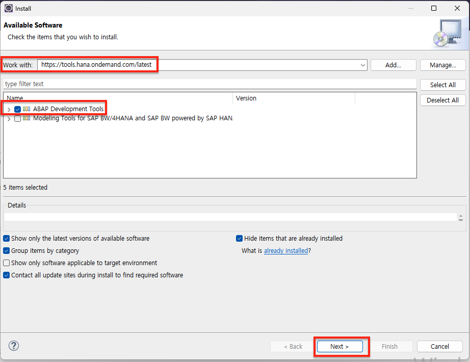

---

title: [SAP] Eclipse 설치
date: 2024-08-08 14:10:00 +0800
categories: [Install, SAP]
tags: [Eclipse]
render_with_liquid: false
---

## 개요

SAP를 개발하기 위한 툴은 크게 3가지 정도가 있다. SAP Gui, Vscode, Eclipse 툴을 사용한다. 특히 SAP HANA 기술을 이용한 개발을 하기 위해서는 필수적으로 Eclipse 툴을 사용해야 한다.(ex. CDS view, SAP HANA Database, ... ) 이번 글에서는 Eclipse 설치 및 SAP 시스템 연결 가이드를 제공한다. 설치 가이드를 소개하기에 앞서 세 가지 툴의 특징에 대하여 간단하게 소개한다.

- **SapGui** : SAP 시스템과 통합이 잘 되어 있어 하나의 인터페이스에서 모든 작업이 수행가능하다. 그러나 ABAP 소스를 개발하기에는 가독성이 떨어지고 직관적이지 않은 단점이 있다.
- **VSCode** : ABAP 소스 코드를 개발하는 데 매우 적합하다. 반응속도가 빠르며 직관적인 UI/UX가 좋다. 하지만, SAP와 통합이 잘되어 있지 않아 사용이 꺼려진다.
- **Eclipse** : 코드 편집, 탐색, 디버깅 등이 모두 직관적이며 편하다. 다만, 자원 소모가 많아 컴퓨터의 처리 속도가 느려질 수 있다는 단점이 있다.

## Eclipse 설치

1. [eclipse](https://www.eclipse.org/downloads/packages/)를 본인 운영체제에 맞는 버전을 클릭하여 다운로드한다. 첨부한 이미지 이외의 다른 버전의 IDE 툴을 사용해도 무방하다. [ADT](https://tools.eu1.hana.ondemand.com/)(ABAP Develeopment tools)을 활용하여 SAP 개발을 진행할 것이기 때문이다.

{: .img-width-ratio-50 }

2. 설치 진행과정에서 프로젝트가 저장될 공간(Workspace)의 경로를 기본 경로로 지정하거나 본인이 지정하고 싶은 경로로 지정한다. 설치가 완료되고 실행했을 때 아래와 같은 화면이 뜨면 정상적으로 완료된 것이다.

   {: .img-width-ratio-50 }

## ADT 플러그인 추가

> 전제조건
> - 운영시스템
>   - 윈도우 10 이상
>   - Apple macOS 10.5 이상
> - Microsoft VC++ Runtime
>   - 윈도우: [Microsoft Visual C++ 2015-2022 Redistributable (x64)](https://learn.microsoft.com/en-US/cpp/windows/latest-supported-vc-redist?view=msvc-170#visual-studio-2015-2017-2019-and-2022)
  {: .prompt-info }

1. Help > Install New Software 선택.

{: .img-width-ratio-50 }

2. Wokr with에 최신 ADT URL `https://tools.hana.ondemand.com/latest`를 붙이고 Enter 키 입력한다. 그리고 ABAP Development Tools를 선택하고 Next 버튼 클릭.

   {: .img-width-ratio-50 }

3. Next 버튼 클릭, 라이센스 동의 후 Finish 버튼 클릭.

   |
   
4. 모두 선택하고 Trust Selected 버튼 클릭.

   {: .img-width-ratio-50 }
5. 설치가 완료되고 Eclipse를 재실행하면 ADT 플러그인 정상수행 확인 가능.

## SAP, Eclipse에 연동
1. File > Other 버튼 클릭

   {: .img-width-ratio-50 }

2. ABAP > ABAP Project 선택 후 Next 버튼 클릭.

   {: .img-width-ratio-50 }

3. SAPGui이 연결되어 있는 온프레미스 시스템을 선택하여 Next 버튼 클릭.

   {: .img-width-ratio-50 }

4. 시스템 연결 정보 확인하고 Next 버튼 클릭.

   {: .img-width-ratio-50 }

5. 시스템 계정정보 입력 후 Finish 버튼 클릭하면 접속완료!

   {: .img-width-ratio-50 }
