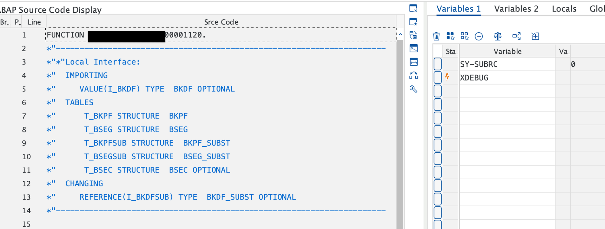

자동 지급 프로그램을 실행할 때, 라인 아이템의 텍스트(sgtxt) 필드가 불러와지지 않는 문제가 있었습니다. SAP 노트 **305414**에 따르면, ***양식에 텍스트를  출력하려는 경우 \*로 시작하는 라인 항목 텍스트(BSEG-SGTXT)가 포함된 항목에 대해 추가 라인이 생성된다는 점을 명심하라.***는 메시지를 주고 있습니다.

하지만 미결전표의 개별 항목 텍스트에  * 접두사로 두는 것이 마음에 들지 않았습니다. 그래서 다른 방법이 있을 것이라는 생각에 대체 프로세스 **SAMPLE_PROCESS_00001120**을 복사하여 정의하고 활성화했습니다. 테스트를 통해 sgtxt 필드가 대체되는지 확인한 후, 미결 항목 개별 항목 텍스트에 * 접두사를 붙이지 않아도 들고 있을 수 있다는 결론에 도달했습니다.

이 글에서는 미결 항목 텍스트를 가져와 대체하는 해결 과정을 공유하고자 합니다.

## 1. F110 디버깅 모드

우선 자동지급 프로그램을 디버깅 모드로 전환하여 미결전표의 회사코드, 전표번호, 회계연도 세 가지 필드를 가지고 올 수 있는 변수가 있는지 확인과정이 필요했습니다.

- **`F110MAIN` 프로그램에서 XDEBUG를 찾아 브레이크 포인트를 지정하고 BTE PROCESS_00001120 을 실행시키는 Function Module 지점에도 브레이크 포인트를 지정합니다.**


- 지급일정을 미래로 두어 배치잡 상태를 릴리즈 상태로 만들어 놓습니다.


- `SM37` 에 들어가 릴리즈한 배치 프로세스를 선택하고 T-CODE 입력창에 `JDBG` 를 입력하고 엔터를 치면 디버깅 모드로 전환이 되며 F8 키를 누르면 `F110MAIN` 브레이크 포인트로 이동합니다. 해당 지점에서 XDEBUG 필드를 **‘X’** 값으로 지정합니다.


- BTE **PROCESS_00001120** 에 디버깅이 잡히는 확인한다.



# 2. 미결전표의 회사코드, 전표번호, 회계연도 가져오기

함수의 로컬변수들에는 미결전표의 내역을 확인할 수 없었습니다. 하지만 `(SAPF110S)REGUH` 구조 변수에 지급에 대한 기본 정보가 포함되어 있기때문에, 이 변수를 활용하여 미결전표의 내역을 가져올수 있었습니다. sap notes ***545340에 따르면 지불 데이터는 REGUH 및 REGUP 테이블에 생성됩니다. REGUH 테이블에는 지불의 유형, 금액 및 수신자에 대한 기본 정보가 포함되어 있으며 REGUP 테이블에는 지불된 송장 항목에 대한 정보가 포함되어 있습니다.*** 라는 정보가 포함되어 있습니다.

아래 코드를 활용하여 미결 항목(거래처)에 대한 텍스트 정보를 가져올 수 있습니다.

```abap
FIELD-SYMBOLS: <reguh> TYPE reguh.
DATA(ls_reguh) = '(SAPF110S)REGUH'.
ASSIGN (ls_reguh) TO <reguh>.

DATA: lv_sgtxt TYPE sgtxt.

WITH +data AS (
    SELECT zbukr AS bukrs, belnr, gjahr
      FROM regup
     WHERE laufd = @<reguh>-laufd
       AND laufi = @<reguh>-laufi
)
SELECT FROM bseg AS item
INNER JOIN +data AS open_item ON item~bukrs = open_item~bukrs
                             AND item~belnr = open_item~belnr
                             AND item~gjahr = open_item~gjahr
                             AND item~koart = @lc_koart_vendor
FIELDS MAX( item~sgtxt ) AS sgtxt
INTO @lv_sgtxt.
```

#### 참조

- [F110 Debugging](https://community.sap.com/t5/financial-management-blogs-by-members/debugging-f110-automatic-payment/ba-p/13482536)

- [F110 Structure Var](https://foros.consultoria-sap.com/t/bseg-sgtxt-sustitucion-f110-campo/45693)