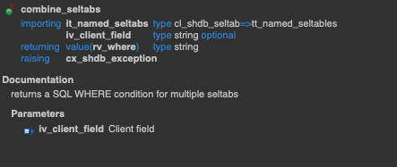

## AMDP, SELECT-OPTIONS

ABAP Program에서 AMDP 프레임워크를 보다 동적으로 활용하기 위해서 `SELECT-OPTIONS` 파라미터 변수를 활용할 수 있어야합니다. 이번 블로그에서는 AMDP 프레임워크에서 `SELECT-OPTIONS` 파라미터를 활용하는 방법을 공유합니다.

SELECT-OPTIOSN 파라마터를 활용하기 위해서는 두 가지 오브젝트를 활용할 수 있어야합니다.

1. **cl_shdb_seltab**
2. **apply_filter**

## 1. cl_shdb_seltab

- `cl_shdb_seltab` 클래스의 `combine_seltabs` 메소드는 `SELECT-OPTIONS` 파라미터를 HANA DB용 SQL WHERE 절로 반환해줍니다. 즉, HANA DB에만 적용되며 OPEN SQL에서는 적용할 수 없습니다.
- `PARAMETERS` 옵션의 매개변수는 적용이 안됩니다.



```abap
* SELECT-OPTIONS
TABLES: sflight.
SELECTION-SCREEN BEGIN OF BLOCK b1 WITH FRAME TITLE TEXT-t01.
  PARAMETERS: p_carrid TYPE s_carrid OBLIGATORY DEFAULT 'AA'.
  SELECT-OPTIONS: s_date FOR sflight-fldate DEFAULT '20220801' TO '20251001',
                  s_pt FOR sflight-planetype DEFAULT 'A340-600'.
SELECTION-SCREEN END OF BLOCK b1.

START-OF-SELECTION.
	 TRY.
      DATA(where_clause) =
      cl_shdb_seltab=>combine_seltabs(
          it_named_seltabs = VALUE #(
              ( name = 'FLDATE' dref = REF #( s_date[] ) )
              ( name = 'PLANETYPE' dref = REF #( s_pt[] ) )
          )
      ). 
*   where_clause 값 
*   ( FLDATE BETWEEN '20240801' AND '20251001') AND( PLANETYPE = 'A319-100')
    CATCH cx_shdb_exception INTO DATA(cx_shdb).

      MESSAGE cx_shdb->get_text(  ) TYPE 'E'.
      LEAVE LIST-PROCESSING.

  ENDTRY.
```

## 2. APPLY_FILTER

`APPLY_FILTER` 함수는 테이블이나 테이블 변수에 동적 필터를 적용합니다. 로직 측면에서는 부분적으로 동적 SQL 문으로 간주될 수 있습니다. 

```sql
-- Syntax
-- 테이블_또는_테이블변수 : WHERE절을 적용하려는 데이터세트
-- WHERE절 : 테이블 또는 테이블 변수에 필터를 적용하려는 WHERE 절
-- 변수 : 결과값 저장
<var> = APPLY_FILTER(<data_set>, <where_clause>);
-- example
data_set = APPLY_FILTER(:data_set, :iv_filter);
```

#### 장점

- 이 함수의 장점은 테이블 변수에 할당할 수 있고 SQL 인라인을 차단하지 않는다는 것입니다.

#### 단점

단점으로는 파라미터화를 지원하지 않는 것입니다. 파라미터가 아닌 상수 값을 사용하기에 상수 값이 변경될 때마다 쿼리 플랜을 새롭게 생성합니다. 이는 파라미터 값이 빠르게 변화하는 시나리오에서는 새로운 쿼리 플랜을 매번 준비해야하기에 성능저하를 야기시킵니다. 따라서 동일한 쿼리 플랜을 다양한 파라미터 값에 대해 재사용할 수 있는 `EXEC ~ USING` 구문을 활용하는 것이 적절합니다.

```sql
-- 아래와 같은 방식으로, 파라미터화된 쿼리를 실행하면 쿼리 플랜 캐시에 동일한 쿼리 플랜을 유지할 수 있습니다.
-- 파라미터 값이 변경되더라도 새로운 쿼리 플랜을 생성할 필요가 없습니다.
EXEC 'SELECT * FROM :lt0 WHERE (' || :column || ' = :value' 
INTO lt USING :lt0, :value;
```

## 코드적용

- Program

```abap
* SELECT-OPTIONS
TABLES: sflight.
SELECTION-SCREEN BEGIN OF BLOCK b1 WITH FRAME TITLE TEXT-t01.
  PARAMETERS: p_carrid TYPE s_carrid OBLIGATORY DEFAULT 'AA'.
  SELECT-OPTIONS: s_date FOR sflight-fldate DEFAULT '20220801' TO '20251001',
                  s_pt FOR sflight-planetype DEFAULT 'A340-600'.
SELECTION-SCREEN END OF BLOCK b1.

START-OF-SELECTION.
  TRY.
      DATA(where_clause) =
      cl_shdb_seltab=>combine_seltabs(
          it_named_seltabs = VALUE #(
              ( name = 'FLDATE' dref = REF #( s_date[] ) )
              ( name = 'PLANETYPE' dref = REF #( s_pt[] ) )
          )
      ).

*    where_clause 값
*   ( FLDATE BETWEEN '20240801' AND '20251001') AND( PLANETYPE = 'A319-100')
    CATCH cx_shdb_exception INTO DATA(cx_shdb).

      MESSAGE cx_shdb->get_text(  ) TYPE 'E'.
      LEAVE LIST-PROCESSING.

  ENDTRY.

  DATA: flights_data TYPE zcl_flights_model=>tt_sflights.
  zcl_flights_model=>get_filter_flights( EXPORTING iv_carrid = p_carrid
                                                  iv_where = where_clause
                                        IMPORTING et_data = flights_data ).
```

- AMDP method

```abap
  METHOD get_filter_flights BY DATABASE PROCEDURE
                            FOR HDB
                            LANGUAGE SQLSCRIPT
                            OPTIONS READ-ONLY
                            USING sflight.

    et_data =
    select carrid, connid, fldate, price,
           currency, planetype, seatsmax, seatsocc
     from sflight
     where mandt = session_context( 'CLIENT' )
       and carrid = :iv_carrid;

    et_data = apply_filter( :et_data, :iv_where );

  ENDMETHOD.
```


#### 참조

- [소스코드 참조](https://github.com/zzzonghwa/abap_blog/tree/main/amdp/select-options)
- [APPLY_FILTER_DOC](https://help.sap.com/docs/SAP_HANA_PLATFORM/de2486ee947e43e684d39702027f8a94/a09d584807f84477a64d7625ca45b089.html)